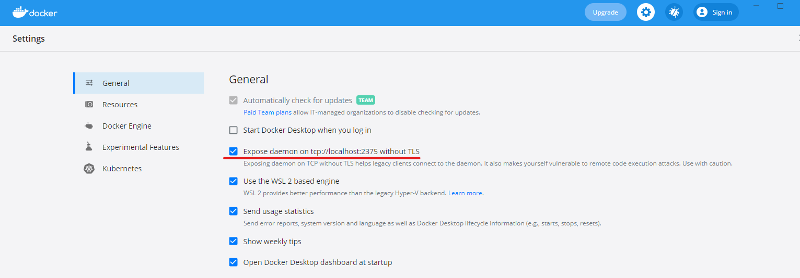

# Event-Driven microservices with Kafka Streams

A skeleton example of how to use [Kafka Streams](https://kafka.apache.org/documentation/streams/) with Event-Driven microservices.

This is an application that generates a simple football statistics like match scores, team and player rankings. It should be a little more comprehensible than a typical code examples based on orders, payments etc.

&nbsp;


You can think of this application as a supplement to the basic code examples of Kafka Streams. Kafka Streams is used here extensively for many purposes like data processing, building materialized views, persisting the domain model and exposing the output of services. Furthermore, there is no traditional database, local state stores instead (PostgreSQL plays a role of legacy system only).

This codebase is trying to apply the idea of [stateful streams processing](https://docs.confluent.io/current/streams/concepts.html#stateful-stream-processing) with [Kafka](https://kafka.apache.org/) and [Kafka Streams](https://kafka.apache.org/documentation/streams/). These blog posts are a great introduction to that concept:
- [The Data Dichotomy: Rethinking the Way We Treat Data and Services](https://www.confluent.io/blog/data-dichotomy-rethinking-the-way-we-treat-data-and-services/)
- [Build Services on a Backbone of Events](https://www.confluent.io/blog/build-services-backbone-events/)
- [Using Apache Kafka as a Scalable, Event-Driven Backbone for Service Architectures](https://www.confluent.io/blog/apache-kafka-for-service-architectures/)
- [Event sourcing using Kafka](https://blog.softwaremill.com/event-sourcing-using-kafka-53dfd72ad45d)

## Services

- __kafka__,
- __zookeeper__,
- __postgres__ - in the role of an external data source,
- __[football-match](football-match/)__ - REST requests transformation into [events](football-common/src/main/java/org/djar/football/model/event/), input validation with the [domain model](https://github.com/djarza/football-events/tree/master/football-match/src/main/java/org/djar/football/match/domain),
- __connect__ - Kafka Connect with [Debezium PostgreSQL connector](http://debezium.io/docs/connectors/postgresql/), writes events for insert or update operations on PLAYERS table to a single Kafka topic,
- __[football-player](football-player/)__ is receiving notifications from __connect__ service and creating only a single [PlayerStartedCareer event](football-common/src/main/java/org/djar/football/model/event/PlayerStartedCareer.java) using [Processor API](https://kafka.apache.org/11/documentation/streams/developer-guide/processor-api.html) (see the [code](football-player/src/main/java/org/djar/football/player/snapshot/DomainUpdater.java)),
- __[football-view-basic](football-view-basic/)__ - builds the statistics from the events using [Kafka Streams DSL](https://kafka.apache.org/11/documentation/streams/developer-guide/dsl-api.html), it's the main place where streams are created and processed (see [below](#events-and-streams)),
- __[football-view-top](football-view-top/)__ - builds the Top 10 Players ranking based on the statistics generated by [football-view-basic](football-view-basic/) and not on the events,
- __[football-ui](football-ui/)__ - saves the statistics into materialized views (local state stores), exposes them via [REST API](football-ui/src/main/java/org/djar/football/ui/controller/StatisticsController.java) and publishes using [WebSocket](football-ui/src/main/java/org/djar/football/ui/StatisticsKeeper.java).

Additional modules:
- __[football-common](football-common/)__ - contains some code that is shared among microservices (obviously it's not a good practice for production), especially:
    - [events](football-common/src/main/java/org/djar/football/model/event/) are used by __[football-match](football-match/)__, __[football-player](football-player/)__ and __[football_view](football-view/)__,
    - [statistics](football-common/src/main/java/org/djar/football/model/view/) - __[football-view-basic](football-view-basic/)__, __[football-view-top](football-view-top/)__, __[football-ui](football-ui/)__,
- __[football-tests](football-tests/)__ - demo application and integration tests.


## Events and Streams

Each [event](football-common/src/main/java/org/djar/football/model/event/) represents a state change that occurred to the system.

| Event               | Fields                                                 |
| ------------------- | ------------------------------------------------------ |
| MatchScheduled      | match id, season, home club, away club, matchDate      |
| MatchStarted        | match id, home club, away club                         |
| GoalScored          | goal id, match id, minute, scorer, scored for          |
| CardReceived        | card id, match id, minute, receiver, type (yellow/red) |
| MatchFinished       | match id                                               |
| PlayerStartedCareer | palyer id, name                                        |

These events are the source for stream processing. For example, in order to determine the result of a match, you must join MatchStarted and GoalScored streams and then count the goals (see the [code](football-view/src/main/java/org/djar/football/view/StatisticsBuilder.java)).


## Domain Model


## Kafka Topics

Topics are organized under logical groups as follows:
- __fb-event.*__ - containing events generated by [football-match](football-match/) and [football-player](football-player/),
- __fb-view.*__ - statistics produced by [football-view-basic](football-view-basic/) and [football-view-top](football-view-top/),
- __fb-connect.*__ - events from the PostgreSQL connector.

The prefixes above aim to separate the application topics from the internal Kafka Streams and Debezium topics.


## REST Endpoints

There are only two REST endpoits and both of them are accessed from the outside of the system:
- [Query interface](football-ui/src/main/java/org/djar/football/ui/controller/StatisticsController.java) in __football-ui__,
- [Command interface](football-match/src/main/java/org/djar/football/match/controller/MatchCommandController.java) in __football-match__.


## How to run

Requirements: Java 10, Docker with at least 6 GB memory limit.

1. Add kafka bootstrap address to your `/etc/hosts`:
    ```
    127.0.0.1 kafka
    127.0.0.1 postgres
    127.0.0.1 connect
    127.0.0.1 football-match
    127.0.0.1 football-player
    127.0.0.1 football-view-basic
    127.0.0.1 football-view-top
    127.0.0.1 football-ui
    ```
2. Build microservices and Docker containers:
   
   
   If you run application via docker installed on Windows plz 'expose deamon' in docker setting
   ```
    cd football
    mvn install
    ```
3. Build and run the demo application:
    ```
    cd football-tests
    mvn install -DskipTests
    java -jar target/football-tests-0.0.1-SNAPSHOT-jar-with-dependencies.jar
    ```
    It will start Docker containers and wait until all microservices are ready.
    
    If the default startup timeout (180 sec) will be insufficient, try to increase it:
    ```
    java -jar target/football-tests-0.0.1-SNAPSHOT-jar-with-dependencies.jar 400
    ```    
4. Wait a minute and launch [http://football-ui:18080/](http://football-ui:18080/). In a few seconds you should see some statistics updated in real time:

&nbsp;


The input is historical data from English Football League Championship. The historical events (goal scored, card received etc.) are played back every few seconds.
